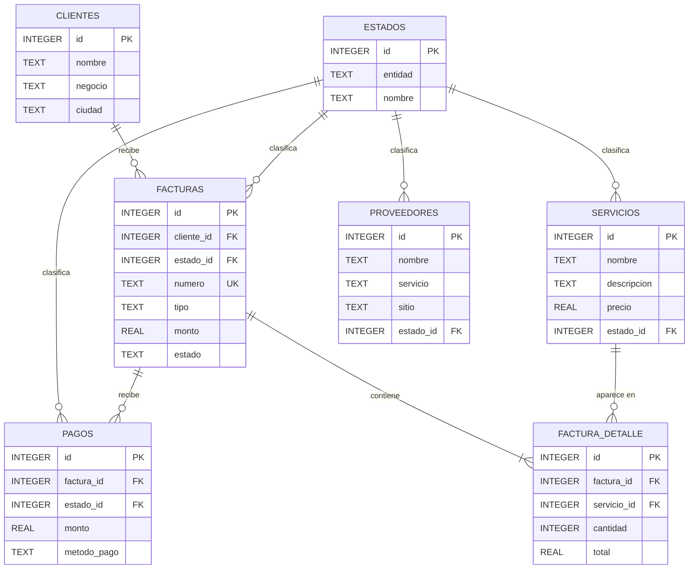

# ⚡ NEXODIGITAL - Soluciones Web y Plataforma Digital

Plataforma web institucional y panel de gestión para el emprendimiento tecnológico **NexoDigital**, desarrollada con **Python (Flask)**, **Jinja2**, **Flask-WTF / WTForms**, **Bootstrap 5** y **JavaScript**.

---

## 👥 Integrantes del Proyecto

- **Cinthia Mishel Carrión Serrano**
- **Aracely Maribel Quintanilla Rumipamba**
- **Santiago Andrés Lara Caicedo**

**Asignatura:** Desarrollo de Aplicaciones Web  
**Institución:** Universidad Estatal Amazónica — Cuarto Semestre  

---

## 🚀 Características y Módulos del Sistema

1. **Página Principal (`/`)**:
   - Presentación de la empresa, propuesta de valor, misión, visión y servicios destacados.
   - Video demostrativo e información complementaria.
   - Formulario de contacto interactivo con validaciones en tiempo real y modales Bootstrap.
   - Módulo dinámico de **Registro de Solicitudes** con manipulación del DOM y persistencia en `localStorage`.

2. **Catálogo de Servicios (`/servicios` o `/servicio`)**:
   - Listado modular de servicios con estados normalizados (`Activo` / `Inactivo`).
   - Formulario para registrar nuevos servicios (`/servicios/nuevo`).
   - Persistencia local en SQLite mediante la tabla `servicios`.

3. **Directorio de Clientes (`/clientes`)**:
   - Tabla interactiva con información de clientes, tipo de negocio y servicio contratado.
   - Formulario de registro de clientes con validaciones (`/clientes/nuevo`).

4. **Gestión de Proveedores (`/proveedores`)**:
   - Directorio de proveedores de infraestructura y software con enlaces directos y badges de estado (`Activo`, `Pendiente`, `Inactivo`).
   - Formulario para agregar proveedores (`/proveedores/nuevo`).

5. **Módulo de Facturación (`/facturacion`)**:
   - Registro de facturas con montos formateados en moneda y estados de pago (`Pagada`, `Pendiente`, `Vencida`).
   - Formulario de emisión de facturas con selector de fecha nativo y validación numérica (`/facturacion/nueva`).

---

## 🛠️ Requisitos e Instalación

### 1. Clonar el Repositorio
```bash
git clone https://github.com/AracelyQuinta/NEXODIGITAL.git
cd NEXODIGITAL
```

### 2. Crear y Activar el Entorno Virtual
En Windows (PowerShell):
```powershell
python -m venv venv
.\venv\Scripts\Activate.ps1
```

### 3. Instalar Dependencias
```bash
pip install -r requirements.txt
```

### 4. Ejecutar la Aplicación
```bash
python app.py
```

Abre tu navegador web e ingresa a: **`http://127.0.0.1:5000/`**

### 5. Persistencia local

La aplicación crea automáticamente `data/nexodigital.db` al iniciar. La capa de acceso está separada en `database.py` y se encarga de:

- Crear un modelo entidad-relación con las tablas `clientes`, `proveedores`, `servicios`, `estados`, `facturas`, `factura_detalle` y `pagos`.
- Relacionar cada factura con un cliente mediante `facturas.cliente_id`.
- Relacionar cada línea de factura con una factura y un servicio mediante claves foráneas.
- Centralizar los estados de servicios, proveedores, facturas y pagos en la tabla `estados`.
- Registrar anticipos y abonos en `pagos`, relacionados con la factura correspondiente.
- Proteger las relaciones con `PRAGMA foreign_keys = ON` y eliminar los detalles cuando se elimina su factura.
- Insertar únicamente los datos que superaron `form.validate_on_submit()`.
- Recuperar el catálogo mediante `SELECT` y `fetchall()` para renderizarlo con Jinja2.
- Confirmar cambios con `commit()` y cerrar cada conexión con `close()`.

### MVC y tercera forma normal

- **Modelo:** `database.py` contiene la conexión, el esquema, las relaciones y el repositorio de servicios.
- **Controlador:** `app.py` recibe las peticiones, valida formularios y coordina el modelo con las vistas.
- **Vista:** las plantillas Jinja2 muestran los datos y heredan de `base.html`.
- Las tablas almacenan atributos que dependen de su clave primaria y usan claves foráneas para las relaciones.
- Los importes de facturación se calculan en `resumen_facturas` a partir de `factura_detalle` y `pagos`, evitando duplicar datos derivados.

### Modelo entidad-relación



Para comprobar la persistencia, registra un servicio en `/servicios/nuevo`, detén `python app.py`, ejecútalo nuevamente y vuelve a visitar `/servicios`.

---

## 📁 Estructura del Proyecto

```text
NEXODIGITAL/
├── app.py                      # Controlador principal y rutas de la aplicación Flask
├── database.py                 # Conexiones, inicialización y consultas SQLite
├── requirements.txt            # Dependencias del proyecto
├── data/
│   └── nexodigital.db           # Base de datos local persistente
├── forms/                      # Formularios construidos con Flask-WTF
│   ├── cliente_form.py
│   ├── facturacion_form.py
│   ├── proveedor_form.py
│   └── servicio_form.py
├── static/
│   ├── css/
│   │   └── estilo.css          # Hoja de estilos personalizada
│   └── js/
│       ├── contacto.js         # Validación interactiva del formulario de contacto
│       └── script.js           # Módulo de solicitudes dinámicas en tiempo real
└── templates/                  # Plantillas modulares con Jinja2
    ├── base.html               # Plantilla maestra con navbar, alerts y footer
    ├── index.html              # Vista de inicio interactiva
    ├── servicios.html          # Vista del catálogo de servicios
    ├── clientes.html           # Vista del directorio de clientes
    ├── proveedores.html        # Vista del directorio de proveedores
    ├── facturacion.html        # Vista de comprobantes y facturación
    ├── formulario_cliente.html
    ├── formulario_servicio.html
    ├── formulario_proveedor.html
    ├── formulario_facturacion.html
    └── components/
        ├── navbar.html         # Barra de navegación con indicador de ruta activa
        └── footer.html         # Pie de página institucional
```

---

## 🛡️ Licencia y Uso
Desarrollado con fines educativos y de aprendizaje para la asignatura de Desarrollo de Aplicaciones Web.
